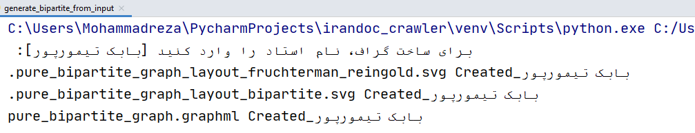
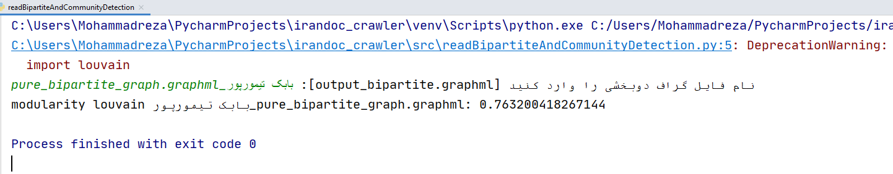
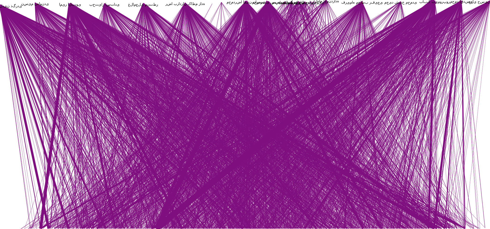

# اجتماع یابی بر روی گراف واژگان استفاده شده در پایان نامه و پیشنهاده های دانشکده صنایع تربیت مدرس در ایرانداک 
در این پروژه، اطلاعات پایان نامه و پیشنهاده اساتید دانشکده صنایع تربیت مدرس از سایت ایرانداک استخراج، در پایگاه داده tmudb.sqlite ذخیره و گراف واژگان آن رسم و اجتماع یابی شده است.
شما می توانید با طی کردن مراحل زیر، خروجی گراف و اجتماع یابی برای هر یک از اساتید مورد نظر خود را دریافت و مشاهده نمایید.

## طریقه استفاده از برنامه

این پروژه به علت استفاده در فرایند‌های دیگری مانند پیاده‌سازی GED، شامل فایل‌های متعددی می‌باشد اما برای استخراج گراف واژگان فقط از دو فایل زیر استفاده می‌کنیم:

 
 - src/generate_bipartite_from_input.py
 - src/readBipartiteAndCommunityDetection.py

ابتدا با دستور زیر، پیش‌نیازهای برنامه را نصب می‌کنیم:

    pip install -r requirements.txt

سپس با دو روش زیر فایل generate_bipartite_from_input.py را اجرا می‌کنیم:

 

 1. از طریق IDE فایل را مستقیم اجرا می‌کنیم
 2. از طریق cmd با دستور زیر اجرا می‌کنیم:
 

 
 `python -m src.generate_bipartite_from_input`
 
 

سپس با وارد کردن نام استاد، اطلاعات استاد از پایگاه داده فراخوانی شده و فایل graphml و خروجی svg ساخته می‌شود:

حال برای اجتماع‌یابی، فایل readBipartiteAndCommunityDetection.py را به یکی از دو صورت بالا اجرا می‌کنیم و نام فایل graphml ساخته شده در مرحله قبل را وارد می‌کنیم:

 
 
 ## گراف دوبخشی
 

 
 
## گراف با clique
 
 
 
 ## تشکر
 لازم است از زحمات و راهنمایی های جناب دکتر تیمورپور در پیش‌برد این پروژه تشکر نمایم.
